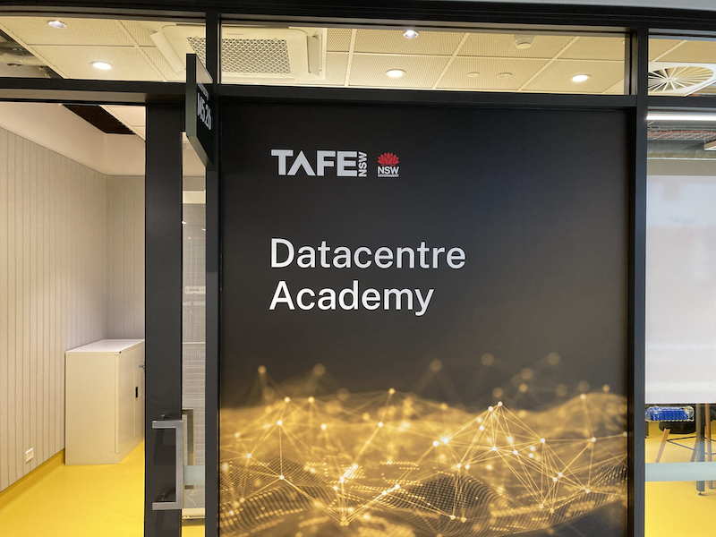

# [TAFE Datacentre Academy 2025](https://www.tafensw.edu.au/partnerships/datacentre-academy)

## TAFE Statement in Datacentre Essentials 800-001365

>A 16-week comprehensive short course designed to prepare learners for the in-demand role of Datacentre Technician. Gain an understanding of the datacentre environment, standard procedures for security and data management. Learn fundamental IT skills, including hardware operations, from installation to diagnostics and decommissioning of equipment.

In November 2024 I was invited to be a part of the pilot program starting in Feburary the following year. The course was delivered over 13 weeks. From the current TAFE description, changes appear to have been made for the next student intake with the course now 16 weeks duration. Hopefully some of the other feeback given has also been taken into account. 

Herein lies my notes that others may find useful.  I'll endevaour to add things as I decifer my chicken scratchings.

[Datacentre Academy Media Releases 2023 - 2025](./media-releases/datacentre-academy-media-releases.md)

TODO: 
- Course overview
- CompTIA A+ / Server+

## Project

**NOTE:** All passwords presented here are examples and MUST be changed if using in production.

### Datacentre Floor Plan

[Floor Plan PDF](./datacentre-floor-plan/DCE-Final-Project-Floor-Plan.pdf)

### Windows Server 2025

- [Known Issues](windows-server/known-issues/known-issues-with-Microsoft-Windows-Server-2025.md)
- [UNP - User Principal Name](windows-server/UNP-User-Principal-Name.md)
- [Windows Server Network Time Protocol (NTP) Server](windows-server/set-network-time-protocol-server.md)

### Example Documentation

TODO:

- [Bare Metal Server 1](./documentation-examples/Final-Project-Bare-Metal-Server-1.md)

### PowerShell

- [Usefull Powershell commands](./windows-server/powershell/Powershell.md)

### Monitoring with Zabbix on Ubuntu 24.04.2 using Docker Containers

<ul>
	<li><a href="./monitoring/Ubuntu-Zabbix-server.md">Ubuntu Server configuration</a></li>
	<ul>
		<li><a href="./monitoring/Ubuntu-Zabbix-server.md#updateos">Update Ubuntu</a></li>
		<li><a href="./monitoring/Ubuntu-Zabbix-server.md#debdocker">Install Ubuntu deb packages for docker</a></li>
		<li><a href="./monitoring/Ubuntu-Zabbix-server.md#fwall">Firewall Settings</a></li>
		<li><a href="./monitoring/Ubuntu-Zabbix-server.md#dhcp">Set DCHP / Static Address</a></li>	
	</ul>
	<li><a href="./monitoring/Ubuntu-Zabbix-server.md#zbxlts">Zabbix 7.0 LTS</a></li>
	<ul>
		<li><a href="./monitoring/Ubuntu-Zabbix-server.md#sszwm">Start / Stop Zabbix Server / Web / Mariadb</a></li>
		<li><a href="./monitoring/Ubuntu-Zabbix-server.md#vzlf">View Zabbix Log Files</a></li>
		<li><a href="./monitoring/Ubuntu-Zabbix-server.md#ldi">List Docker Images</a></li>
		<li><a href="./monitoring/Ubuntu-Zabbix-server.md#zdcdoc">Zabbix Docker Container Documentation</a></li>
	</ul>
</ul>

TODO:

<ul>
	<li>Windows Server 2025 / Hyper-V 2019 Monitoring</li>
	<ul>
		<li>Zabbix client</li>
		<li>SNMP</li>
	</ul>
	<li>Synology DS223J NAS monitoring</li>
	<ul>
		<li>SNMP</li>
	</ul>
</ul>

